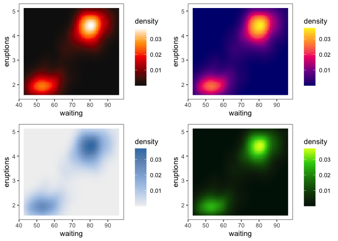
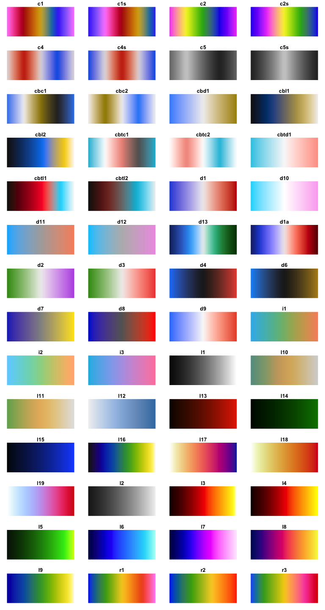

## CET Perceptually Uniform Colour Maps (`cetcolor`)

[](http://www.repostatus.org/#active)
[](https://travis-ci.org/coatless/cetcolor)
[](https://cran.r-project.org/package=cetcolor)
[](http://www.r-pkg.org/pkg/cetcolor)

The [`cetcolor`](https://cran.r-project.org/package=cetcolor) package is
designed to bring to *R* the 56 colour maps created by [Peter
Kovesi](http://peterkovesi.com/projects/colourmaps/) that avoid points
of locally high colour contrast leading to the perception of false
anomalies in your data when there is none. The colour maps have been
designed to avoid this phenomenon by having uniform perceptual contrast
over their whole range.

### Installation

The `cetcolor` package is available on both CRAN and GitHub. The CRAN
version is considered stable while the GitHub version is in a state of
development and may break.

You can install the stable version of the `cetcolor` package with:

``` r
install.packages("cetcolor")
```

For the development version, you can opt for:

``` r
install.packages("devtools")
devtools::install_github("coatless/cetcolor")
```

### Sample Usage

``` r
# Load the Library
library("cetcolor")

# Get RGB Hexadecimals for graphing
cet_pal(5, name = "blues")
#> [1] "#F1F1F1" "#C0D3EB" "#93B5DD" "#7197C1" "#3B7CB2"

# Sample use with ggplot2
library("ggplot2")

ggplot(faithfuld, aes(waiting, eruptions)) +
  geom_raster(aes(fill = density)) +
  theme_bw() + theme(panel.grid=element_blank()) -> g

library("gridExtra")

# Frequently used colour maps have "nicknames" see ?cet_color_maps 
grid.arrange(
  g + scale_fill_gradientn(colours = cet_pal(5, name = "fire")),
  g + scale_fill_gradientn(colours = cet_pal(5, name = "inferno")),
  g + scale_fill_gradientn(colours = cet_pal(5, name = "blues")),
  g + scale_fill_gradientn(colours = cet_pal(5, name = "kgy")),
  ncol = 2, nrow = 2
)
```

<!-- -->

``` r
# Show a panel of possible values (without nicknames)
display_cet_all()
```

<!-- -->

## References

### CET

  - [CET Perceptually Uniform Colour Maps: Download
    Page](http://peterkovesi.com/projects/colourmaps/)
      - Location of CSV data, references, and data.
  - [colorcet for Python](https://github.com/bokeh/colorcet)
      - Shorthand naming of colour schemes and presentation of palettes
  - [PerceptualColourMaps.jl by Peter
    Kovesi](https://github.com/peterkovesi/PerceptualColourMaps.jl)
      - Referenced documentation and possible reimplementation of
        generation functions to avoid using CSV data.

### R Colour Palettes

  - [`viridis`](https://cran.r-project.org/package=viridis)
    ([Source](https://github.com/sjmgarnier/viridis))
      - Provides MATLAB perceptually uniform colour maps in a manner
        that is similar to this package.
  - [`RColorBrewer`](https://cran.r-project.org/package=RColorBrewer)
    ([Source](RColorBrewer))
      - Function interface naming, e.g. `cet_pal(n, name)`, and colour
        map
    displays.
  - [`scales`](https://github.com/hadley/scales/blob/646b6a433e6f7106bed4173569898fac409d22b5/R/pal-brewer.r)
    and
    [`ggplot2`](https://github.com/tidyverse/ggplot2/blob/f6f9f9de41c48382c70cbccc253db198e3cdc128/R/scale-brewer.r)
      - Proper ways to interface colour palettes with `ggplot2` as shown
        for `RColorBrewer`.

## Future

  - Allow for n \> 256.
  - Provide hooks for ggplot2 gradient and discrete scales
  - Port over the Peter’s generation code from Julia / MATLAB to R.

## License

CC BY-SA 4.0
